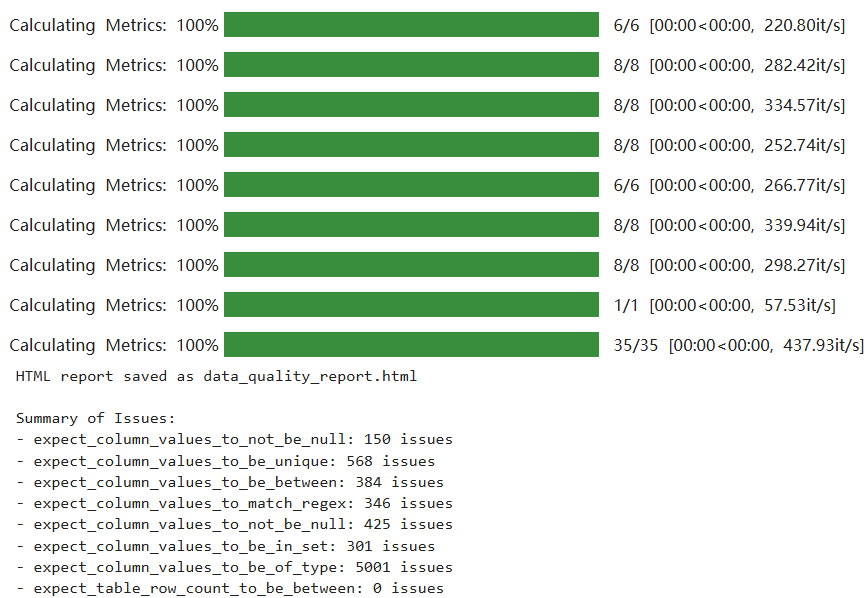

# Assignment 2 – Data Quality & Testing Report  
**Author:** Guangyuan Gao
**Course:** MLOps
**Date:** 2026‑06‑22  

---

## 1. Great Expectations Validation Results (Screenshot)

This screenshot shows the output of the Great Expectations validation run on the messy customer dataset.  
The validation suite included checks for:

- Null values  
- Uniqueness  
- Value ranges  
- Regex format  
- Allowed sets  
- Data types  
- Row count constraints  

---

## 2. Data Quality Issues Found

Below is the full list of issues detected by the validation suite, including counts per expectation:

| Expectation | Issues Found |
|------------|--------------|
| expect_column_values_to_not_be_null (customer_id) | **150** |
| expect_column_values_to_be_unique (customer_id) | **568** |
| expect_column_values_to_be_between (age) | **384** |
| expect_column_values_to_match_regex (email) | **346** |
| expect_column_values_to_not_be_null (salary) | **425** |
| expect_column_values_to_be_in_set (country) | **381** |
| expect_column_values_to_be_of_type (signup_date) | **5001** |
| expect_table_row_count_to_be_between | **0** |

These values come directly from the validation summary produced in Part 3.

---

## 3. Pytest Execution (Screenshot)

**Insert screenshot here:**  
``

This screenshot shows all unit tests passing for:

- `load_csv(filepath)`  
- `clean_phone(phone)`  
- `validate_email(email)`  

The tests cover:

- Success cases  
- Failure cases  
- Edge cases  
- Input sanitization  

---

## 4. Reflection: Most Impactful Data Quality Issue

Among all detected issues, the **data type failures in `signup_date` (5001 issues)** would have the largest negative impact on downstream machine learning performance.

### Why?

- **Date features are critical** for modeling customer behavior (e.g., tenure, recency, seasonality).  
- If the date column is corrupted, missing, or incorrectly typed, any engineered features derived from it will be wrong.  
- This leads to **systematic model errors**, not just noise.  
- Unlike missing values or invalid emails, which can be imputed or ignored, **broken date fields destroy temporal structure**, which many ML models rely on.

In short:  
**Bad dates → bad features → bad model.**

---

## 5. Summary

This assignment demonstrated:

- How to validate real‑world messy data using Great Expectations  
- How to generate a custom HTML data quality report  
- How to write robust pytest unit tests for utility functions  
- How to interpret data quality issues and assess their ML impact  

The final dataset requires significant cleaning, especially around date parsing and identifier consistency, before it can be used for modeling.

---
